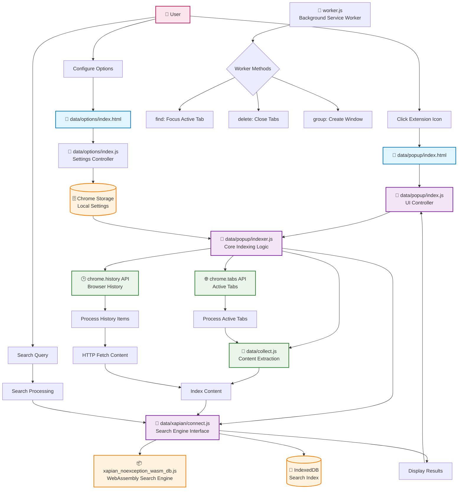
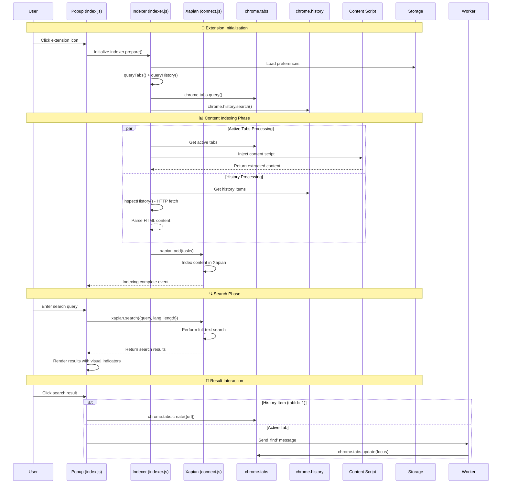

# Search All Tabs - Code Flow Diagram

## Architecture Overview



## Detailed Function Flow



## Key Function Entry Points

```mermaid
mindmap
  root((🔧 Entry Points))
    🎯 User Actions
      Click Extension Icon
        ::icon(fa fa-mouse-pointer)
      Configure Options
        ::icon(fa fa-cog)
      Search Query Input
        ::icon(fa fa-search)
    📜 Core Functions
      indexer.prepare()
        Load Preferences
        Initialize Settings
      indexer.query()
        Query Active Tabs
        Process Tab Data
      indexer.queryHistory()
        Query Browser History
        HTTP Content Fetch
      xapian.search()
        Full-text Search
        Result Ranking
    🔄 Background Events
      chrome.tabs.onRemoved
        Clean Cache
      chrome.runtime.onMessage
        Handle Tab Operations
      engine-ready Event
        Update UI State
```

## Debug Logging Strategy

The following console.debug logs have been added to trace execution flow:

### 🎯 Entry Points
- `🚀 Extension popup opened - engine ready event received`
- `⚙️ Options page loaded with settings:`
- `🔍 Search query entered:`

### 📊 Indexing Flow
- `🔧 Indexer.prepare() - Loading preferences`
- `⚙️ Indexer preferences loaded:`
- `📋 Found X active tabs, Y history items to process`
- `🔄 Processing batch X/Y (items N-M)`
- `✅ Indexed history item/tab: URL (N documents)`
- `🎉 Indexing complete! Indexed X documents, ignored Y items`

### 🕒 History Processing
- `🕒 History search disabled` / `🕒 Querying browser history: X days back, max Y results`
- `📖 Found X history items`
- `📡 Fetching content for history item: URL`
- `✅ History content parsed: TITLE (X chars)`
- `❌ Cannot fetch content for history item: URL`

### 🔍 Search Operations
- `🎯 Search started: QUERY in LANG language`
- `📊 Search results: X found, Y estimated`
- `🏷️ Result N: TITLE (X% match) [history/tab]`

### 🎮 User Interactions
- `👆 Opening history item in new tab: URL`
- `👆 Focusing active tab: TAB_ID URL`
- `🔧 Background worker received message: METHOD`
- `⚙️ Saving extension settings:`

## How to View Debug Logs

1. **Open Browser Developer Tools**:
   - **Chrome**: F12 or right-click → Inspect → Console tab
   - **Firefox**: F12 or right-click → Inspect Element → Console tab

2. **View Extension Console Logs**:
   - **For popup logs**: Open extension popup, then open DevTools
   - **For options logs**: Open extension options page, then open DevTools  
   - **For background worker logs**: Go to `chrome://extensions/` → Extension details → Service worker → inspect → Console

3. **Filter Debug Logs**:
   - In console, type: `console.debug` to see only debug messages
   - Look for emoji prefixes to identify different components:
     - 🚀 = Extension startup
     - 🔧 = Indexer operations
     - 🕒 = History processing
     - 🎯 = Search operations
     - 👆 = User interactions
     - ⚙️ = Settings/configuration

4. **Real-time Monitoring**:
   - Keep DevTools open while using the extension
   - Watch the console as you search, configure settings, etc.
   - Debug logs will show the complete execution flow